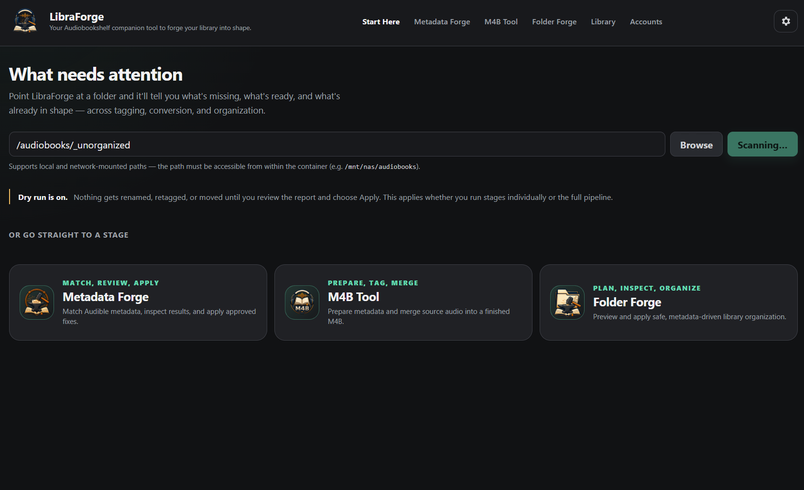

# LibraForge

> **Note:** This tool is in active development. Features and interfaces may change.

Self-hosted Audible metadata matching, M4B conversion, Audiobookshelf-style library
organisation, and direct Audible downloading - four tools in one Docker container, with
a vanilla-JS web UI. Every write operation defaults to a dry run.



---

## Features

### Start Here (`/`)
Pick a folder and get a one-glance scan summary: how many books need metadata, need
conversion, and are ready to organise. Links through to the right tool for each stage.

### Metadata Forge (`/forge`)
Searches Audible (or another provider) and writes matched metadata to your files.

- **Dry-run first**, then enable **Apply** to write. **Backup and cache** on the first
  apply preserves originals and speeds up later runs.
- **Concurrent workers** (v5): parallel Audible search with a per-thread client pool,
  per-query de-duplication, and a persistent chapter-count cache that makes repeat
  discovery near-instant.
- **Write modes:** `smart` (skip the write when embedded tags already match),
  `fill-missing` (only write currently-empty fields), `overwrite` (always write).
- **ASIN aware:** the matched ASIN is embedded in every file; if a file already carries
  an ASIN (tags or `[B0XXXXXXXX]` in the name) it is looked up directly first, and an
  ASIN mismatch flags the book for manual review.
- **Manual Review:** load any book or folder, search Audible manually, and apply per
  book with an explicit `Full metadata` or `Series only` mode.
- **Providers:** Audible (direct), **Audiobookshelf** (via its own search API), and
  **abs-agg** (LibriVox, Storytel, BookBeat, Big Finish, and others).

### M4B Tool (`/m4b-tool`)
Converts or merges audio into a single M4B. Loads existing fixer sidecars automatically,
scans for multipart / non-M4B conversion candidates, and exposes codec, bitrate, and job
count. `No conversion` is safe only when all source streams are AAC with matching sample
rate and channel layout.

### Folder Forge (`/organizer`)
Plans and applies `Author/Series/Book N - Title` destination moves with a dry-run
preview and structured review reasons. **Index library and exit** rebuilds the
destination-structure cache on its own.

### Library Downloader (`/library`)
Browse your Audible library and download purchases straight into a mounted folder,
decrypted to standard **M4B** with chapters, metadata, embedded cover, and ASIN intact -
no external tooling. Supports AAX (`activation_bytes`) and AAXC (per-file voucher).
Books already in your library are flagged as **Owned**; a per-run or per-book rule
controls duplicate handling (Keep both / Replace), and an optional pass auto-organises
the downloads when finished.

### Accounts (`/auth-setup`)
Guided Audible OAuth sign-in - no CLI tools. Connect **multiple accounts**, each with a
recognisable name, and **switch between them in one click**, rename them, or **disconnect**
cleanly (deregisters the device with Audible, then removes the login; offers retry or
local-only delete if Audible is unreachable). The active account is shared by every tool.

This page also configures the **Audiobookshelf** and abs-agg providers. Paste an
Audiobookshelf API key (create one in ABS Settings → Users → API Keys) into the masked
field and click **Save and verify**; the key is stored server-side and never shown back in
the browser. Use **Remove key** to delete it with one click. ABS is also what makes the
Library Downloader's "already owned" detection instant. The key can alternatively be set
once via the `ABS_API_KEY` environment variable (an env-set key is managed by the operator
and cannot be removed from the UI).

### Planned
- **Script modularisation** - complex functions split out of `app.js` and `main.py` into
  dedicated, standardised modules with clean interface contracts (the fixer itself is
  already split into `app/fixer/{scoring,parsing,clues,tagging,search}.py`).
- **Mobile-friendly web UI** - responsive layout pass so manual review and run controls
  are usable on a phone.
- **Pipeline unification** - persistent stage stepper across pages, and an optional
  "run full pipeline" mode chaining fixer -> m4b-tool -> organizer automatically.
- **Full provider validation** - end-to-end tests for the abs-agg sources that don't
  have dedicated tests yet: **LibriVox, Storytel, Audioteka, BookBeat, Big Finish, ARD
  Audiothek, Die drei ???**. Confirmed working today: Audible, Audiobookshelf, and (via
  dedicated special-provider detection + tests) GraphicAudio and Soundbooth Theater,
  plus Goodreads and Kindle via abs-tract. The untested ones only go through abs-agg's
  generic keyword search path, with no confirmation that every response shape
  normalises to the shared metadata schema without silent field drops.
- Local agent advisory review (read-only LLM suggestions, no automatic writes).
- Chapter detection via speech recognition before M4B conversion.
- Unraid Community Apps package.

Debug tracing already exists today (opt-in, `app/debug_trace.py`, toggleable in
Settings) and writes to a log file/stderr - a raw log is the intended form for this,
not a UI feature, so no further work is planned there.

---

## Install

Requires Docker with the Compose plugin. Clone and start - no config needed:

```bash
git clone https://github.com/coconautilus17/LibraForge.git
cd LibraForge
make up
```

Then open **http://127.0.0.1:5056**. That's it - `make up` builds the image, creates the
first-boot data folders, and runs the container as your user so mounted files stay
writable. Without `make`, `docker compose up -d --build` works too (it falls back to a
repo-local `./data/` library and UID/GID `1000`).

**Point it at your library.** By default LibraForge mounts the empty `./data/audiobooks`
and `./data/auth` folders. To use your real library, copy the env file and set the paths:

```bash
cp .env.example .env      # then edit AUDIOBOOKS_PATH / AUDIBLE_AUTH_PATH, and UID/GID if not 1000
make up                   # re-run to apply
```

Connect an Audible account from the **Accounts** page, or skip Audible and use
Audiobookshelf / abs-agg as providers. For HTTPS, attach to your reverse proxy network
via `docker-compose.override.yml` (git-ignored).

Common commands: `make up`, `make down`, `make logs`, `make restart`, `make test`
(run `make help` for the full list).

### Run the published image (no clone)

The image on GitHub Container Registry is self-contained - the only thing you
provide is the path to your library. Audible auth and run reports persist in
named volumes, so there is nothing else to set up:

```bash
docker run -d --name libraforge \
  --user "$(id -u):$(id -g)" \
  -p 127.0.0.1:5056:5056 \
  -v /path/to/your/audiobooks:/audiobooks \
  -v libraforge-auth:/auth \
  -v libraforge-reports:/app/reports \
  ghcr.io/coconautilus17/libraforge:latest
```

Or with Compose - download [`docker-compose.dist.yml`](docker-compose.dist.yml) and run:

```bash
AUDIOBOOKS_PATH=/path/to/your/audiobooks \
  docker compose -f docker-compose.dist.yml up -d
```

Then open **http://127.0.0.1:5056** and connect an Audible account on the
Accounts page (or skip it and use Audiobookshelf / abs-agg). Upgrade later with
`docker pull ghcr.io/coconautilus17/libraforge:latest`.

### Optional companion services

| Service | Purpose | Required? |
|---|---|---|
| [Audiobookshelf](https://www.audiobookshelf.org/) | Metadata provider via ABS's built-in search API. Create a dedicated API key in ABS Settings → Users → API Keys and add it on the Accounts page. | No |
| [abs-agg](https://github.com/Vito0912/abs-agg) | Aggregates metadata from LibriVox, Storytel, BookBeat, Big Finish, and others. Deploy on the same Docker network; set the URL in provider settings. | No |

---

## Container paths

| Purpose | Path |
|---|---|
| Audiobook library | `/audiobooks` |
| Audible auth directory | `/auth` - active account `/auth/audible-metadata.json`; saved accounts `/auth/accounts/` |
| Scripts | `/app/scripts` |
| Reports and caches | `/app/reports` |

## Safety

- All operations default to dry-run. Review before applying, and back up media before
  the first write.
- A dedicated, empty Audible account is recommended for metadata lookups; use a
  real-library account for the downloader.
- The `/auth` directory is mounted **read-write** so the app can add, switch, and
  disconnect accounts. Point `AUDIBLE_AUTH_PATH` at a dedicated directory - not your
  primary audible-cli config - and keep it off untrusted networks.

**Do not expose LibraForge to an untrusted network.** It can write file metadata, move
files, launch conversions, and access your Audible account. There is no built-in
authentication - anyone who can reach the port has full access. Run it behind
[Tailscale](https://tailscale.com/), a VPN, or a reverse proxy with authentication
(e.g. Caddy `basicauth`, Authelia). The default `127.0.0.1` binding keeps it
localhost-only; do not change this without adding access control.

## Development

```bash
# Run tests (inside the container, where dependencies are installed)
make test

# Restart after backend (app/main.py) changes
make restart

# Rebuild after Dockerfile or dependency changes
make rebuild
```

Static files (`app/static`, `scripts/`) are bind-mounted - HTML, CSS, and JS edits are
live without a restart.

LibraForge is licensed under [AGPL-3.0-or-later](LICENSE). See
[THIRD_PARTY_NOTICES.md](THIRD_PARTY_NOTICES.md) for dependency licence information.
